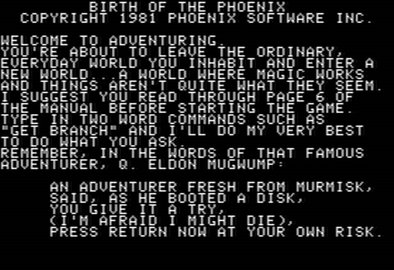

# Birth Of The Phoenix   ![Badge Publisher]

*Source code provided by **[Paul Berker]**.*

 

 
 

[![Button Interview]][Interview]

 
 

 
 

## Platforms

<kbd>  Apple II  </kbd>   <kbd>  Atari 8-bit  </kbd>

 
 

## Files

*The file archives provided.*

[![Button Source]][Source]   
[![Button Disk]][Disk]

 

### Backup

[![Button Source]][Source Backup]   
[![Button Disk]][Disk Backup]

 

### Atari

[![Button Source]][Source Atari]   
[![Button Disk]][Disk Atari]

 

### Atari Backup

*Bad track 6*

[![Button Source]][Source Atari Backup]   
[![Button Disk]][Disk Atari Backup]

 

### Games Channel

[![Button Source]][Source Games Channel]   
[![Button Disk]][Disk Games Channel]

 

### Games Network Channel

[![Button Source]][Source Games Network Channel]   
[![Button Disk]][Disk Games Network Channel]

 

<!----------------------------------------------------------------------------->

[Paul Berker]: https://slasherworld.com/

[Interview]: https://archive.org/details/paul-berker-phoenix-software

[Source Games Network Channel]: Source/Games%20Network%20Channel
[Source Games Channel]: Source/Games%20Channel
[Source Atari Backup]: Source/Atari%20Backup
[Source Atari]: Source/Atari
[Source Backup]: Source/Backup
[Source]: Source/Birth%20of%20the%20Phoenix

[Disk Games Network Channel]: Disks/Games%20Network%20Channel.DSK
[Disk Games Channel]: Disks/Games%20Channel.DSK
[Disk Atari Backup]: Disks/Atari%20Backup.DSK
[Disk Atari]: Disks/Atari.DSK
[Disk Backup]: Disks/Backup.DSK
[Disk]: Disks/Birth%20of%20the%20Phoenix.DSK

<!----------------------------------[ Badges ]--------------------------------->

[Badge Publisher]: https://img.shields.io/badge/Publisher-Phoenix_Software-bb603d?style=for-the-badge&labelColor=EF7B4D

<!---------------------------------[ Buttons ]--------------------------------->

[Button Interview]: https://img.shields.io/badge/Interview-49B48A?style=for-the-badge&logoColor=white&logo=InternetArchive
[Button Source]: https://img.shields.io/badge/Source-0091BD?style=for-the-badge&logoColor=white&logo=CodeFactor
[Button Disk]: https://img.shields.io/badge/Disk-50162D?style=for-the-badge&logoColor=white&logo=Discogs

